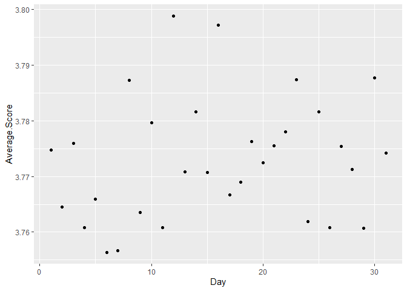

The Numbers behind Popular Music
================

# The Numbers behind Popular Music

Authors: Jasper Jansen, Jolie Jacobus, Soren Wagstrom, Quita Jackson

## Abstract (TL;DR)

Our team investigated the factors behind popular music. We used a
dataset detailing the top 5000 albums of all time. This data comes from
the website rateyourmusic.com, however we found this dataset on
Kaggle.com. Our team was interested in this topic as music fans, and we
wanted to explore the trends in popular music over the years. Our main
findings were that most higher rated albums were released before 1980.
The most rated and reviewed artists on the list were Radiohead, The
Velvet Underground, Nirvana, and Pink Floyd. There was no significant
trend in ratings of genres over time. Of the most common genres, the
highest rated genre was Film Score, and the lowest rated genre was Hard
Rock. When the album was released had a negative correlation with the
rating for the album, and the number of review and ratings had a
positive correlation with the rating of the album.

# Intro/Background/Motivation

Our team investigated the factors behind popular music. We used a
dataset detailing the top 5000 albums of all time. This data comes from
the website rateyourmusic.com, however we found this dataset on
Kaggle.com. This project is relevant because by analyzing trends in
popular music, this project could help artists predict future trends in
the music industry or help them to decide when to release their music to
get the best results.

In section [Results 1](#results-1) we show the relationship between the
album release date and the rating of the album. In section [Results
2](#results-2), popularity of the artist is considered with the ratings
of the albums. In section [Results 3](#results-3), trends in the ratings
of genres is explored over time. In section [Results 4](#results-4), the
relationship between score and the album’s genre, descriptors, and
artist is investigated.

# Quick Data Summary

Our dataset is the list of the top 5000 rated albums on the website
rateyourmusic.com. The dataset includes the ranking, album title,
artist, release date, genre(s), descriptors, average rating, number of
ratings, number of reviews

<table style="width:99%;">
<colgroup>
<col style="width: 12%" />
<col style="width: 73%" />
<col style="width: 13%" />
</colgroup>
<thead>
<tr class="header">
<th>Variable</th>
<th>Description</th>
<th>Summary Statistics</th>
</tr>
</thead>
<tbody>
<tr class="odd">
<td>Ranking</td>
<td>The ranking out of 5000 for the album</td>
<td>
Integer type

Range: 1-5000
</td>
</tr>
<tr class="even">
<td>Album</td>
<td>The Album Name</td>
<td>Character type</td>
</tr>
<tr class="odd">
<td>Artist.Name</td>
<td>The artist of the album’s name</td>
<td>Character type</td>
</tr>
<tr class="even">
<td>Average.Rating</td>
<td>The average rating of the album</td>
<td>
Numerical type

Range: 3.52-4.34
</td>
</tr>
<tr class="odd">
<td>Number.of.Ratings</td>
<td>The number of ratings the album has</td>
<td>
Integer type

Range: 260-70382
</td>
</tr>
<tr class="even">
<td>Number.of.Reviews</td>
<td>the number of reviews the album has. A review includes a text
review, whereas with a rating a user only inputs a numerical rating for
the album.</td>
<td>
Integer type

Range: 0-1549
</td>
</tr>
<tr class="odd">
<td>Genre_1 - Genre_5</td>
<td>The genre the album is classified as. Each album could have up to 5
genre classifications.</td>
<td>Character type</td>
</tr>
<tr class="even">
<td>Desc_1 - Desc_10</td>
<td>The descriptor the album is classified as. Each album could have up
to 10 descriptors.</td>
<td>Character type</td>
</tr>
<tr class="odd">
<td>Artist.Average.Score</td>
<td>The average rating for all of an artist’s albums on the list</td>
<td>
Numerical type

Range: 3.52-4.34
</td>
</tr>
<tr class="even">
<td>Artist.Average.Reviews</td>
<td>The average number of reviews an artist’s album has.</td>
<td>
Numerical type

Range: 0-929
</td>
</tr>
<tr class="odd">
<td>Artist.Average.Ratings</td>
<td>The average number of ratings an artist’s album has.</td>
<td>
Numerical type

Range: 260-46438
</td>
</tr>
<tr class="even">
<td>Artist.Frequency</td>
<td>How many times an artist’s album appears in the dataset.</td>
<td>
Integer Type

Range: 1-25
</td>
</tr>
<tr class="odd">
<td>Year, Month, Day</td>
<td>The year, month and day the album was released of the album.</td>
<td>
Integer/Character Type

Year Range: 1947 - 2021
</td>
</tr>
</tbody>
</table>

# Results

In your write-up, make sure to refer to all of the figures you create.
You can include a hyperlink to the [scatterplot](#fig:scatterplot) by
using the name of the code chunk (make sure, to give each code chunk a
different name). In your markdown document you can create this link
either by calling the function `chunkref` with the name of the code
chunk in quotes, i.e. [scatterplot](#fig:scatterplot) or by using the
markdown expression `[scatterplot](#fig:scatterplot)`. Similarly, we can
refer to the [2nd scatterplot](#fig:2nd%20scatterplot). Note that the
figure captions appear above the figures - this saves us from having to
scroll up after following the link.

<small><strong><a name='fig:scatterplot'>scatterplot</a></strong>: This
is the figure caption. Make sure to use the description we practised in
the homework: first sentence describes structure of the plot, second
sentence describes main finding, third sentence describes
outliers/follow-up.</small>

<small><strong><a name='fig:2nd scatterplot'>2nd
scatterplot</a></strong>: This is the figure caption. Make sure to use
the description we practised in the homework: first sentence describes
structure of the plot, second sentence describes main finding, third
sentence describes outliers/follow-up.</small>

Additionally, you can also refer to different sections in your writeup
by using anchors (links) to section headers. Here, we are referring to
subsection [Results 3](#results-3). The code for that is `[Results 3]`.

## Results 1

-What is the relationship between the release date and the score of the
album? **Quita**

<!-- -->

This graph shows the average score of each album by the year it was
realeased and then colered it by the year so I to better visuaize it. By
doing this, I hoped to figure out which years has the best or worst
scored albums. Most of the scores sit between 3.6 and 4. When looking at
the graph, I see that the lowest rated album was released in 2017
whereas the best rated album was realeased in 1963. It is important to
remember that these are the top rated albums on the site overall, so the
ratings are not terrible but it looks like as the years increase, you
see the cluster of rating moving more towards the lower end of the
septrum.

<!-- -->

This graph scores the average score that all albums recieved by the the
year. My conclusion of a overall decresing score as the move from year
to year is confirmed when looking at this graph.There is a huge increase
in average score as you move towards the 70’s but then it starts to
decline shortly after. There is an outlier in 1954 but I am choosing to
ignore that because the amount of albums was very limited for that year,
there is a total of 6 albums released that year in the data set.

    ## `summarise()` has grouped output by 'Month'. You can override using the
    ## `.groups` argument.

<!-- -->

This graph looks at the average score of albums by the month they were
released it. Music is sometimes seasonal so uing this graph, I might be
able to spot potential seasonal trends that may have occured with the
Top 5000 Albums. When looking at the graph, it shows that December is
the month with the highest rated albums where as May is the month with
the lowest rated albums. I would have assumed the complete oppisite
since May is right before the summer and that is often the start of
festival season but this graph tells me somethind different.

<!-- -->

This graph shows the realtionhip between the day of realease and the
album score. There is not much pattern to this graph but it appears that
albums realeased during the month are more highly rated.

Comclusion: Overall, I would say that there is a pattern of when the
album is realeased to the score it gets. I cannot make any further
conclusions since I do not know more about the audience that is rating
the album and did not account for other facors like genre and artist.

## Results 2

-What is the relationship between the number of reviews/ratings and the
artist? This helps determine the relative popularity of artists on this
website.

**Soren** \# Question 2: Who are the most well-known artists on this
website, and does that correlate with high scores?

Answering this question will involve determining the average number of
ratings/reviews per artist. This can be accomplished using mutate
statements to create two new columns, one for average number of ratings
per artist, and one for average number of reviews per artist. The number
of reviews per artist will be much lower than the number of ratings,
because writing a review takes much more time and effort than simply
providing a score from 1-5. This is not a reflection of an artist’s
popularity outside the context of this website, as this is a website for
dedicated fans of music, who tend to have different tastes than the
general public.

The average number of ratings and reviews per artist from each of their
appearances on this list is already determined by the data processing
above, so the only step remaining for this question is to visualize and
communicate the results.

The plot below shows the top 10 artists by average number of ratings.
Radiohead tops the list, followed by The Velvet Underground and Nirvana.
These are all very popular mainstream artists, so there is no surprise
here. They all have very high average scores as well, indicating that
these artists are as beloved as they are famous. There are some less
well-known artists on this list as well, such as Slint and Godspeed You,
Black Emperor!, which may indicate that these artists are more popular
among music enthusiast crowds like the RateYourMusic community than
among the general public.

The next plot, shown below, includes the top 10 artists by average
number of reviews. Again, The Velvet Underground and Nirvana are in the
top 3, but Pink Floyd takes the third spot this time around, followed
closely by Radiohead.

There are two outliers in the top 10 in terms of score here. Both Guns
N’ Roses and The Sex Pistols have a much lower average score than the
others on this list. One conclusion that could be drawn from this
statistic it that while these two artists are clearly very well known,
they are not as widely beloved among music enthusiasts as others on this
list, and their fame may somewhat overrate the quality of their music.

## Results 3

This section will explore how scores for genres change over time.

    ## [1] 453

There are 435 unique genres in the dataset. This would be too much to
cover in a plot, so we will focus on the genres that occur most on the
list.

    ## # A tibble: 453 × 3
    ##    Genre_1            Average.Score count
    ##    <chr>                      <dbl> <int>
    ##  1 Progressive Rock            3.76   225
    ##  2 Singer/Songwriter           3.78   158
    ##  3 Hard Bop                    3.80   116
    ##  4 Film Score                  3.81   114
    ##  5 Hard Rock                   3.75   111
    ##  6 Heavy Metal                 3.77   108
    ##  7 East Coast Hip Hop          3.80   100
    ##  8 Video Game Music            3.85    96
    ##  9 Alternative Rock            3.75    93
    ## 10 Progressive Metal           3.72    80
    ## # … with 443 more rows

Progressive Rock, Singer/Songwriter, Hard Bop, Film Score, Hard Rock,
Heavy Metal, and East Coast Hip Hop are the top seven genres the occur
the most on the list.

<small><strong><a name='fig:Genre Scores Over Time'>Genre Scores Over
Time</a></strong>: This is a lineplot grouped by the top 7 most common
genres in the dataset. Most genre’s scores oscillate around 3.8. However
Heavy Metal had a steep decline during the 70s. It would be interesting
to compare with the charts in future exploration.</small>

Most genre’s average scores over the years appear to be fairly
consistent. Heavy Metal started out strong in 1970, but then the genre
suffered a steep decline by the end of the decade, plateauing around
3.75. Hard Rock had the lowest average score, and throughout the
timeline barely broke 3.8 at its highest peak. Hard bop, Film Score,
Singer/Songwriter and east coast hip hop seem to be oscillating around
an average rating of 3.8.

<small><strong><a name='fig:Average Genre Scores'>Average Genre
Scores</a></strong>: This is a barplot of the top 7 most common genres’
average ratings. The highest scoring genre overall is Film Score, and
the lowest scoring genre is Hard Rock. The average scores for each genre
are very similar which makes sense as we are looking at the top 5000
albums so they all should have fairly high scores.</small>

The average scores for each genre are very similar which makes sense as
we are looking at the top 5000 albums so they all should have fairly
high scores. Film Score had the highest average score with 3.81, and
Hard Rock had the lowest average score at 3.75.

<small><strong><a name='fig:Occurrence of Genres over Time'>Occurrence
of Genres over Time</a></strong>: This is a lineplot of the counts of
the top 7 most common genres over time. The 70s had the most albums from
the most popular genres released. Progressive rock had the highest
number of occurrences on the list, which was almost double any other
peak</small>

Looking at the count for the genres over time, it can be seen that from
the beginning of the 50s to the end of the 60s Hard Bop Jazz was the
dominating genre for music. The 70s is the Rock era with Progressive and
Hard Rock occurring the most with the Singer/Songwriter genre close to
the Hard Rock genre. The 80s had Heavy Metal as the genre that occurred
the most. Finally, East Coast Hip Hop is the most occurring genre for
the 90s. The Singer/Songwriter and Progressive rock genre came back a
little in the early 2000s.

In conclusion, the most popular genre’s scores appear to oscillate over
the years, with a fairly consistent average around 3.8 for all genres.

## Results 4

-What is the relationship between score and other variables, such as
genre, descriptors, and artist? **Jasper**

By answering this question we will be able to have a better idea of how
albums are scored and what the stronger criterion are that affect scores
for each album. First we will look for the unique values of genres,
descriptors and artists to identify how many of each category we have.
Once that is accomplished, we will be using the dplyr library and
grouping the data by genre to graph it with the ggplot library. Using
these graphs we will be able to see how different categories affect
score.

# First: Identify Question

# Question: What is the relationship between score and other variables, such as genre, descriptors, and artist?

### Find the Top 10 Most Common Genres, Descriptors, and Artists

    ## # A tibble: 453 × 2
    ##    Genre_1            count
    ##    <chr>              <int>
    ##  1 Progressive Rock     225
    ##  2 Singer/Songwriter    158
    ##  3 Hard Bop             116
    ##  4 Film Score           114
    ##  5 Hard Rock            111
    ##  6 Heavy Metal          108
    ##  7 East Coast Hip Hop   100
    ##  8 Video Game Music      96
    ##  9 Alternative Rock      93
    ## 10 Progressive Metal     80
    ## # … with 443 more rows

- Progressive Rock, Singer/Songwriter, Hard Bop, Film Score, Hard Rock,
  Heavy Metal, East Coast Hip Hop, Video Game Music, Alternative Rock,
  and Progressive Metal are the top 10 most common Genres.

<!-- -->

    ## # A tibble: 166 × 2
    ##    Desc_1          count
    ##    <chr>           <int>
    ##  1 "male vocals"     411
    ##  2 "instrumental"    271
    ##  3 "energetic"       234
    ##  4 "melodic"         174
    ##  5 "melancholic"     171
    ##  6 "female vocals"   147
    ##  7 "atmospheric"     122
    ##  8 "psychedelic"     115
    ##  9 ""                114
    ## 10 "passionate"      114
    ## # … with 156 more rows

- Male Vocals, Instrumental, Energetic, Melodic, Melancholic, Female
  Vocals, Atmostpheric, Psychedelic, Passionate, and Dark are the top 10
  most common Descriptors.

<!-- -->

    ## # A tibble: 2,787 × 2
    ##    Artist.Name     count
    ##    <chr>           <int>
    ##  1 Various Artists    25
    ##  2 Miles Davis        17
    ##  3 John Coltrane      14
    ##  4 Tom Waits          13
    ##  5 John Williams      12
    ##  6 Bob Dylan          11
    ##  7 The Beatles        10
    ##  8 Ennio Morricone     9
    ##  9 Herbie Hancock      9
    ## 10 Pharoah Sanders     9
    ## # … with 2,777 more rows

- Various Artists, Miles Davis, John Coltrane, Tom Waits, John Williams,
  Bob Dylan, The Beatles, Ennio Morricone, Herbie Hancock, Pharoah
  Sanders, and The Fall

### Average Score of the Top 10 Most Common Genres, Descriptors, and Artists

    ## [1] 3.771304

- The average score for all albums in the list is 3.771304.

<!-- -->

    ## [1] 3.775546

- The average score for albums with their primary genre in the top 10
  most common genre is 3.775546.

<!-- -->

    ## [1] 3.771124

- The average score for albums with their primary descriptor in the top
  10 most common descriptors is 3.771124

<!-- -->

    ## [1] 3.855435

- The average score for albums with their artists in the top 10 most
  common artists is 3.855435.

<!-- -->

    ## [1] 3.797607

- The average score for an album with any of the previous top 10 values
  included in the album is 3.7976607.

### Average Score of !Top 10 most common genres, descriptors, artists

    ## [1] 3.771201

- The average score when the top 10 most common primary genres are
  removed is 3.771201.

<!-- -->

    ## [1] 3.771311

- The average score when the top 10 most common primary descriptors are
  removed is 3.771311

<!-- -->

    ## [1] 3.768916

- The average score when the top 10 most common artists are removed is
  3.768916.

<!-- -->

    ## [1] 3.768879

- The average score when the top 10 most common artists, genres, and
  descriptors are removed is 3.768879.

### Correlation matrix to find what is most correlated with score

    ##                   Average.Rating Artist.Name Genre_1 Desc_1  Year
    ## Average.Rating              1.00        0.02    0.02   0.05 -0.17
    ## Artist.Name                 0.02        1.00    0.02   0.00  0.04
    ## Genre_1                     0.02        0.02    1.00   0.05 -0.03
    ## Desc_1                      0.05        0.00    0.05   1.00 -0.03
    ## Year                       -0.17        0.04   -0.03  -0.03  1.00
    ## Number.of.Ratings           0.35       -0.02   -0.03   0.05  0.17
    ## Number.of.Reviews           0.45        0.01   -0.01   0.05  0.01
    ##                   Number.of.Ratings Number.of.Reviews
    ## Average.Rating                 0.35              0.45
    ## Artist.Name                   -0.02              0.01
    ## Genre_1                       -0.03             -0.01
    ## Desc_1                         0.05              0.05
    ## Year                           0.17              0.01
    ## Number.of.Ratings              1.00              0.82
    ## Number.of.Reviews              0.82              1.00

- Using our correlation matrix we can see that Number.of.Reviews is our
  strongest predictor of Average Rating with Number.of.Ratings close
  behind. If we were making a model to predict the average rating for an
  album we would include the variables: Number.of.Reviews,
  Number.of.Ratings, and Year.

# Conclusions

To summarize, our investigation found that most higher rated albums were
released before 1980. The most rated and reviewed artists on the list
were Radiohead, The Velvet Underground, Nirvana, and Pink Floyd. There
was no significant trend in ratings of genres over time. Of the most
common genres, the highest rated genre was Film Score, and the lowest
rated genre was Hard Rock. When the album was released had a negative
correlation with the rating for the album, and the number of review and
ratings had a positive correlation with the rating of the album.

Some limitations of our investigation was that the demographic of the
users inputting this data on rateyourmusic.com is unknown. If our team
had more we thought it would be interesting to compare this dataset and
our results with the albums charting data such as number of sales and if
the album won any awards.

## Data source

<https://www.kaggle.com/datasets/tobennao/rym-top-5000>

“rateyourmusic does not attempt to claim copyright or ownership of
material that you submit, however, rateyourmusic claims a non-exclusive
worldwide, royalty free, perpetual, non-revocable license to reproduce
your material (Otherwise, we would not be able to display it to other
users). In addition, you agree to give other users the same license to
reprint or save your material for their personal use.”

## References

List all resources you used.
